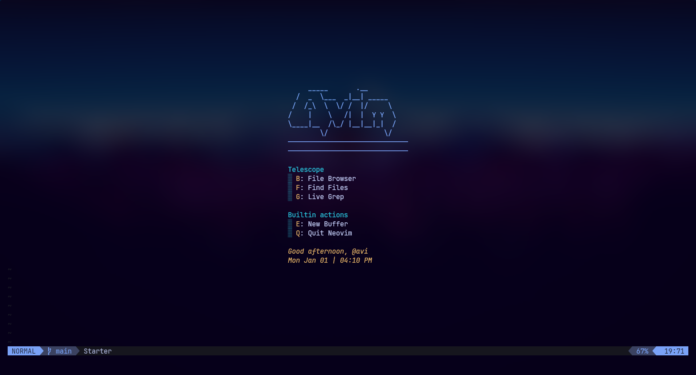
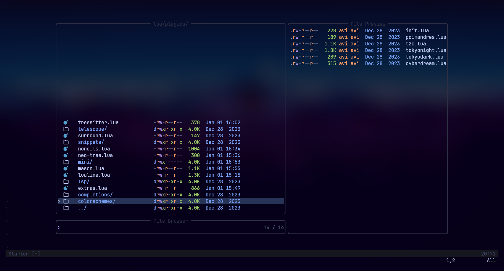
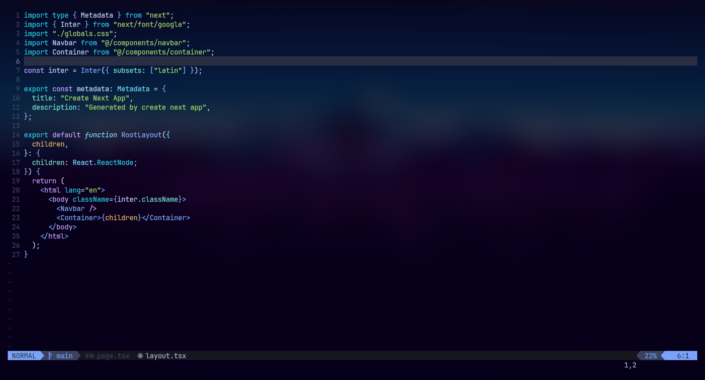

# Avi's Neovim Config

This repo contains my config files for my neovim setup.

## Roadmap

- [x] Setup `lazy.nvim`
- [x] Setup keymaps
- [x] Setup Telescope
- [x] Setup LSP
- [x] Setup completions with `cmp`
- [x] Setup formatter & linters
- [x] Setup `mason.nvim`
- [x] Fix buffers
- [x] Setup fugitive
- [ ] Setup snippets

## How to solve mason issue?

Problem: The LSP weren't working even after installing it with mason
Solution: Add the location of them to PATH
